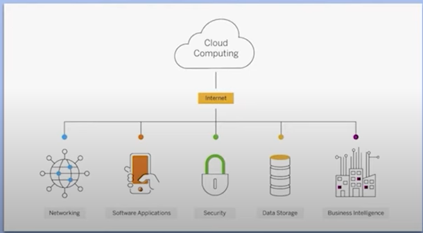
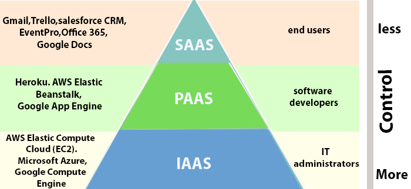

Introduction to cloud computing

What is cloud computing?

It is on demand delivery of IT resources over the internet with pay-as-you-go pricing.
Instead of buying, owning and maintaining physical data centers and servers you can use technology services such as computing power, storage and database.
e.g. Google drive. We get storage over internet and pay for it.

